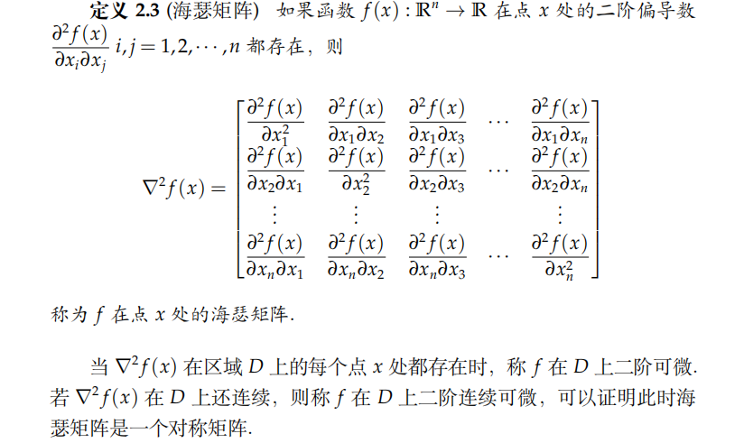

## 基础知识
### 范数
#### 向量范数
从向量空间$\mathbb{R}^n$到实数域$\mathbb{R}$的非负函数，如果满足正定性、齐次性和三角不等式，则称为范数

最常用的向量范数为$\mathcal{l}_p$范数($p \ge 1$):

在最优化中，$\mathcal{l}_1$、$\mathcal{l}_2$ 以及 $\mathcal{l}_{\infty}$是比较重要的

此外还有，由正定矩阵$A$诱导的范数: ${\Vert {x} \Vert}_A \triangleq \sqrt{x^{\mathrm{T}} A x}$

对于$\mathcal{l}_2$范数，我们有：

#### 矩阵范数
矩阵范数和向量范数类似，只是定义在矩阵空间上

直接推广向量范数，定义矩阵的$\mathcal{l}_1$、$\mathcal{l}_2$范数分别为：

矩阵的$\mathcal{l}_2$范数也被称为Frobenius范数，或者简称F范数。F范数具有正交不变性，即左乘或右乘相应尺寸的正交矩阵不改变F范数的大小

上述定义中的两个向量范数均取$\mathcal{l}_p$就得到矩阵的$p$范数

本书常用矩阵的$2$范数

容易验证，矩阵的$2$范数就是矩阵的最大特征值

根据算子范数的定义，所有算子范数具有相容性，即

#### 矩阵内积
除了定义矩阵独自的范数外，关于矩阵之间的关系，还可以定义它们之间的内积。范数用来衡量矩阵的模的大小，内积用来表征两个矩阵(或其张成的空间)之间的夹角。

考虑一种常用的内积——Frobenius内积，两个$m \times n$矩阵的Frobenius内积定义为：

定义了矩阵内积后，我们就有关于矩阵范数的：

### 导数
#### 梯度与Hessian矩阵
梯度的定义如下：

更常用的表达为：

关于二阶导数信息，定义Hessian矩阵如下：

定义Jacobian矩阵：

综上，给出多元函数的泰勒展开定理如下：

最后，介绍一类特殊的可微函数——梯度Lipschitz连续函数

梯度Lipschitz连续的重要性质是二次上界(其中定义域的条件可以削弱为凸集)：

#### 矩阵函数的导数

称$G$为$f$在Frechet可微意义下的梯度。类似于向量函数，矩阵函数的梯度可以用偏导数表示：

实践中，矩阵Frechet可微的定义和使用往往比较繁琐，因此我们介绍另一种定义——Gateaux可微：

Frechet可微是Gateaux可微的充分不必要条件，但是一般情况下对此无需区分

实践中使用Gateaux可微来计算导数更为容易

#### 自动微分

### 广义实值函数
优化中常遇到取上确界或下确界的操作，这可能导致函数的取值为无穷。为了更方便描述优化问题，我们需要对函数的定义进行扩展。

#### 适当函数
适当函数是一类重要的广义实值函数，对于最优化问题$\mathop{\mathrm{min}}\limits_{x} f(x)$, 适当函数能够帮助除掉一些我们不感兴趣的函数。

若无特殊声明，一般认为所讨论的都是适当函数，同时将定义域取在小于正无穷的区域

#### 闭函数
闭函数是另一类重要的广义实值函数，可以看成连续函数的一种推广。介绍闭函数之前先引入一些基本概念：
下水平集：

上方图：

下面给出闭函数和下半连续函数的定义：

### 凸集

### 共轭函数

### 