## 约束优化算法
### 罚函数法
将约束优化问题转化为无约束优化问题，在目标函数加上与约束函数有关的惩罚项。
#### 等式约束的二次罚函数法
考虑包含等式约束的优化问题：
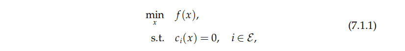

最先考虑的是通过求解等式约束，消去部分变量，但是很多时候这是不可实现的

对于可行域外的点，惩罚项为正；对于可行域内的点，惩罚项为零

对于等式约束问题，惩罚项的选取方式有很多，结构最简单的是二次罚函数：
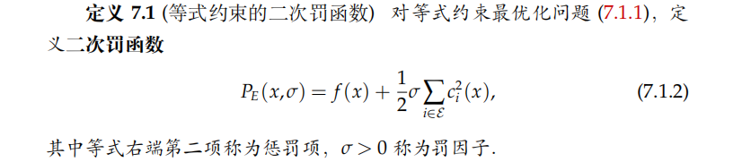

这一方法对不满足约束的点进行惩罚，迭代过程中点列会处于可行域之外，因此也被称为外点罚函数

在可行域内，$P_E (x,\sigma)$的全局极小值点与约束优化问题的最优解相同；

可行域外，收到$\sigma$取值的影响，会出现复杂情况。取值太大，可能条件病态难以优化或出现其他极值点，取值太小，不可行解处的函数下降抵消了罚函数对约束违反的惩罚，函数值可能无下界

包括罚因子的选取，完整的二次罚函数法算法如下：
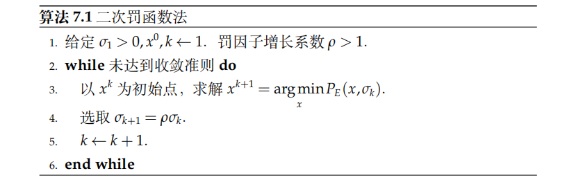

算法第三行中的argmin可能表示全局极小解、局部极小解或近似满足一阶最优性条件的非严格极小解

#### 收敛性分析
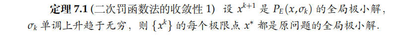

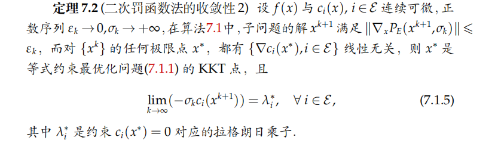

#### 一般约束问题的二次罚函数法
考虑包含不等式约束的优化问题：
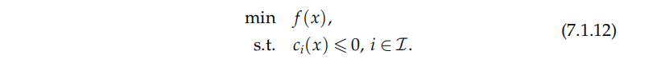

需要对惩罚函数进行调整：
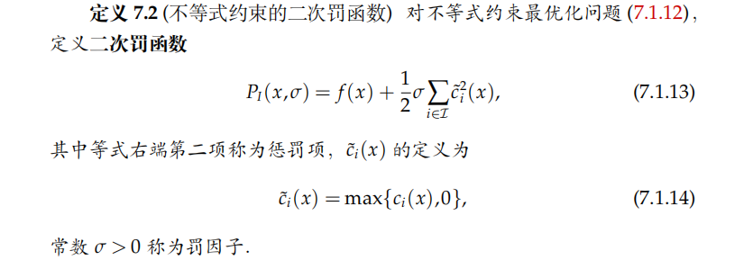

注意到函数$h(t)=(min{t,0})*2$关于$t$是一阶可导的，可以使用梯度类算法，但不是二阶可导，因此不能直接利用二阶算法来求解

对于包含一般约束的优化问题：
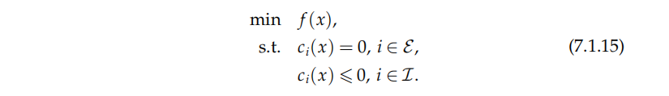

只需将两种罚函数相加即可：
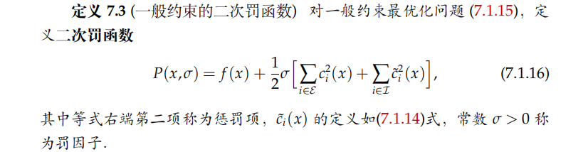

外点罚函数法存在数值困难：随着罚因子不断增大，子问题会由于Hessian矩阵条件数的增大而难以求解

#### 其他类型的罚函数法
##### 内点罚函数法
子问题解序列从可行域内部逼近最优解；要求迭代时自变量始终不能违反约束，严格位于约束内部，因此主要用于不等式约束优化

基本思路是当迭代点接近可行域边界时，需要罚函数区域正无穷，常用的是对数罚函数：
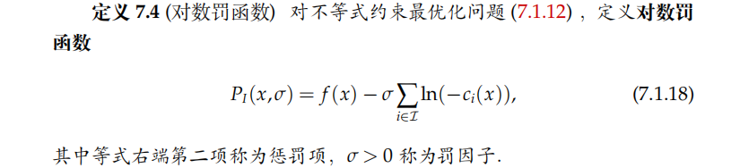

内点罚函数法的算法如下：
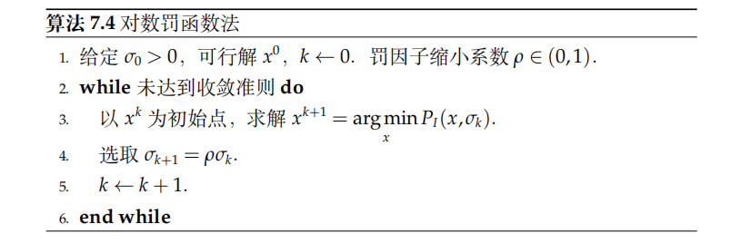

对数罚函数法要求初始点$x^0$是一个可行解，常用的收敛准则为：

内点罚函数法也面临着内点罚函数法类似地数值困难

##### 精确罚函数法
无论是二次罚函数还是对数罚函数，求解过程都必须包括罚因子的渐进过程，从而带来一定的数值困难。有些罚函数只需要适当选取罚因子进行求解就能得到原问题的精确解，这类罚函数称为精确罚函数。使用精确罚函数的算法通常会有比较好的性质。

常用的精确罚函数是$\mathrm{l}_1$罚函数：
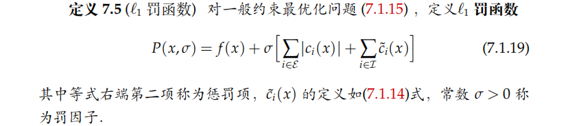

使用$\mathrm{l}_1$罚函数的精确性由如下定理给出：
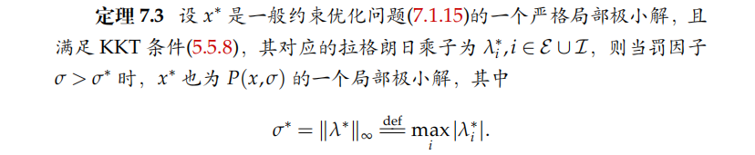

### 增广拉格朗日法
在二次罚函数法中，根据收敛性定理2，需要罚因子趋于正无穷才能保证可行性。那么能否通过对二次罚函数进行修正，使得对有限的罚因子，得到的逼近最优解也是可行的？增广拉格朗日函数法即使如此
#### 等式约束问题的增广拉格朗日函数法
##### 方法构造
对于等式约束优化问题，增广拉格朗日函数定义为：

即在拉格朗日函数的基础上，添加约束的二次罚函数

具体算法如下：
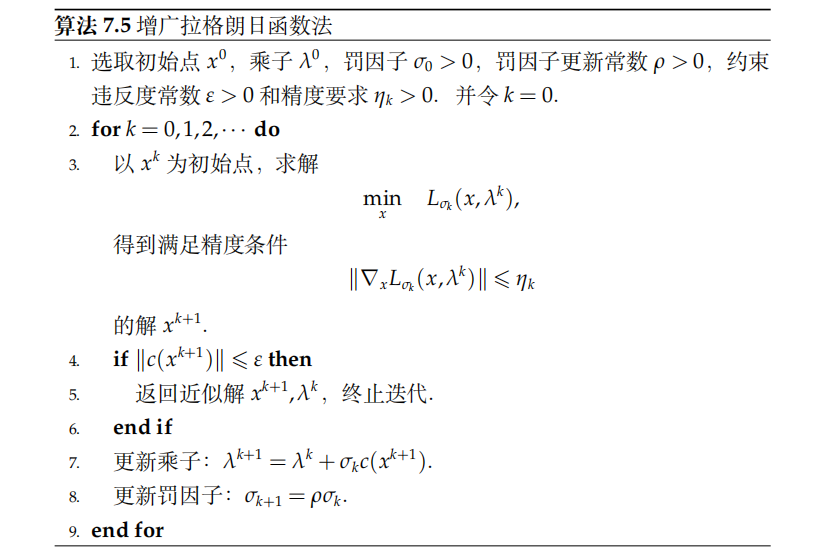

##### 收敛性
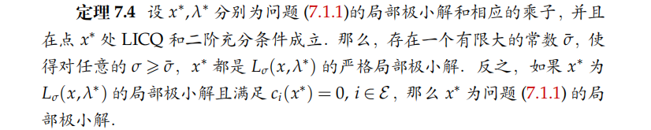

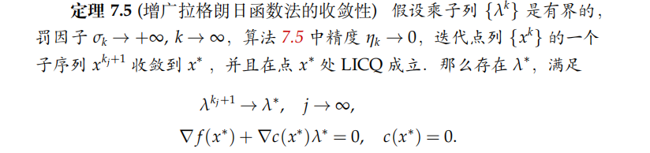

### 线性规划内点法