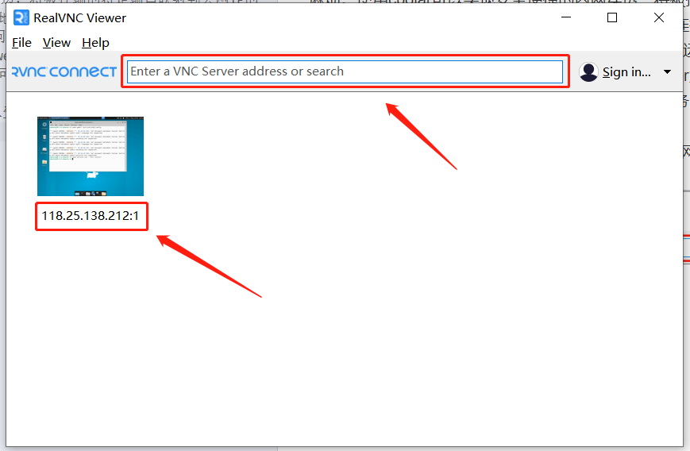

## 实现远程办公
### ssh的配置
如果服务器是windows系统，需要开放公钥所在的授权文件的权限。授权文件包括C:/Users/%Username%/.ssh/authorized_keys和C:/ProgramData/ssh/administrators_authorized_keys。
权限设置命令如下：
`icacls.exe "file_dir" /inheritance:r /grant "Administrators:F" /grant "SYSTEM:F"`

### 向日葵

### cpolar+VNC
公网IP需要申请，因此大部分主机只有内网IP，访问需要经过内网服务器，非常麻烦。使用cpolar可以实现安全便捷的内网穿透，将被控端的特定端口映射到公网IP的端口上，从而控制端能够直接通过公网稳定地连接被控端。
从公网就可以通过ssh进行连接和命令行访问。要实现远程桌面还需要其他软件。这里以RealVNC提供的VNC Server和VNC Viewer为例。顾名思义，VNC Server在服务端也就是被控端安装，然后启动相应服务即可；而VNC Viewer在客户端也就是控制端安装。
使用时，首先在被控制端运行vncserver打开服务，然后在控制端打开VNC Viewer，图中红框处输入受控端公网IP地址，冒号后接要使用地端口，如图中连接的历史记录所示
